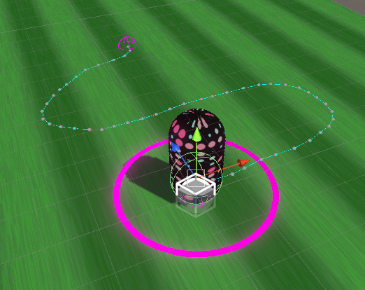
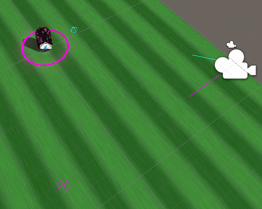

# Unity Attributes

## Bar Attribute
This attribute draws a simple bar to create a seperator line between properties

## Group Attribute
This header attribute changes the color of the header text. With underline to help sections standout.

## Note Attribute
Places helpboxes above properties. Can be hidden with foldout.

# Test Scripts 

### Test Draw

Captures mouse or touch 'hold' input as a series of waypoints. Will draw over everything unless a layermask is used to ignore everything but what you want to draw on.

Example: Create a new layer, call it Pathing. Create a plane or set viable drawing colliders with the pathing layer. The script will only add waypoints where the ray hits the collider with the layer mask.

### Test Draw From

This script will not start

### Test Input Actions

Allows for debugging of mouse and touch positions. Draws gizmos and rays to see where a user touches in game.

