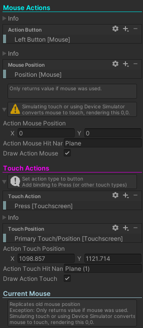

# Unity Attributes

## Bar Attribute
This attribute draws a simple bar to create a seperator line between properties

## Group Attribute
This header attribute changes the color of the header text. With underline to help sections standout.

## Note Attribute
Places helpboxes above properties. Can be hidden with foldout.

# Test Scripts 

### Test Input Actions

Allows for debugging of mouse and touch positions. Draws gizmos and rays to see where a user touches in game.